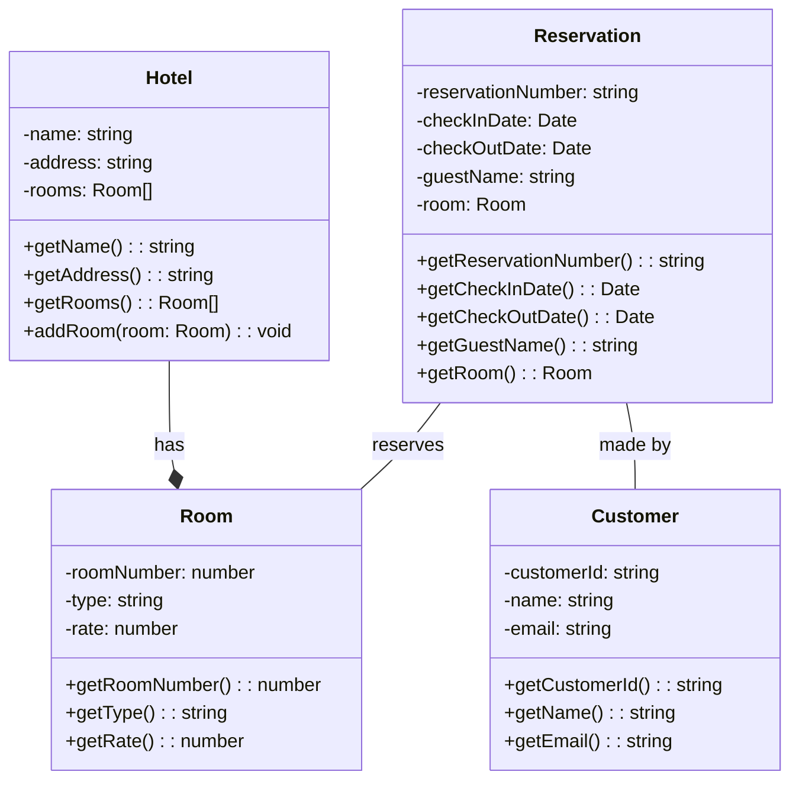

# test2

```mermaid


classDiagram
  class Hotel {
    -name: string
    -address: string
    -rooms: Room[]
    +getName(): string
    +getAddress(): string
    +getRooms(): Room[]
    +addRoom(room: Room): void
  }
  
  class Room {
    -roomNumber: number
    -type: string
    -rate: number
    +getRoomNumber(): number
    +getType(): string
    +getRate(): number
  }

  class Reservation {
    -reservationNumber: string
    -checkInDate: Date
    -checkOutDate: Date
    -guestName: string
    -room: Room
    +getReservationNumber(): string
    +getCheckInDate(): Date
    +getCheckOutDate(): Date
    +getGuestName(): string
    +getRoom(): Room
  }

  class Customer {
    -customerId: string
    -name: string
    -email: string
    +getCustomerId(): string
    +getName(): string
    +getEmail(): string
  }

  Hotel --* Room : has
  Reservation -- Room : reserves
  Reservation -- Customer : made by


```
