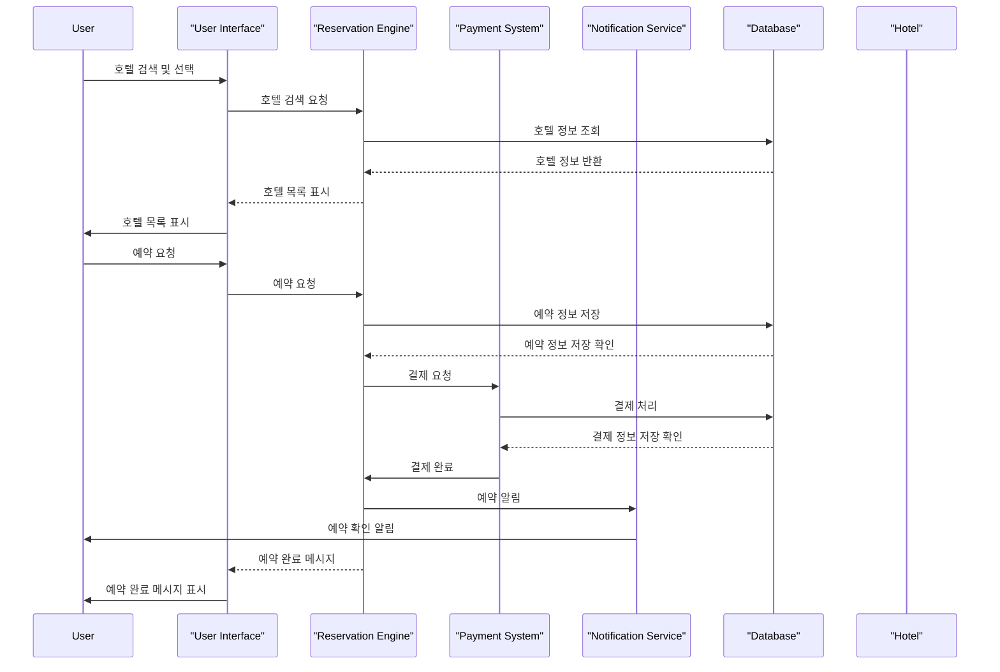

# test2

```mermaid
sequenceDiagram
    participant User
    participant UI as "User Interface"
    participant ReservationEngine as "Reservation Engine"
    participant PaymentSystem as "Payment System"
    participant NotificationService as "Notification Service"
    participant Database as "Database"
    participant Hotel as "Hotel"
    
    User->>UI: 호텔 검색 및 선택
    UI->>ReservationEngine: 호텔 검색 요청
    ReservationEngine->>Database: 호텔 정보 조회
    Database-->>ReservationEngine: 호텔 정보 반환
    ReservationEngine-->>UI: 호텔 목록 표시
    UI->>User: 호텔 목록 표시
    
    User->>UI: 예약 요청
    UI->>ReservationEngine: 예약 요청
    ReservationEngine->>Database: 예약 정보 저장
    Database-->>ReservationEngine: 예약 정보 저장 확인
    ReservationEngine->>PaymentSystem: 결제 요청
    PaymentSystem->>Database: 결제 처리
    Database-->>PaymentSystem: 결제 정보 저장 확인
    PaymentSystem->>ReservationEngine: 결제 완료
    ReservationEngine->>NotificationService: 예약 알림
    NotificationService->>User: 예약 확인 알림
    ReservationEngine-->>UI: 예약 완료 메시지
    UI->>User: 예약 완료 메시지 표시


```
